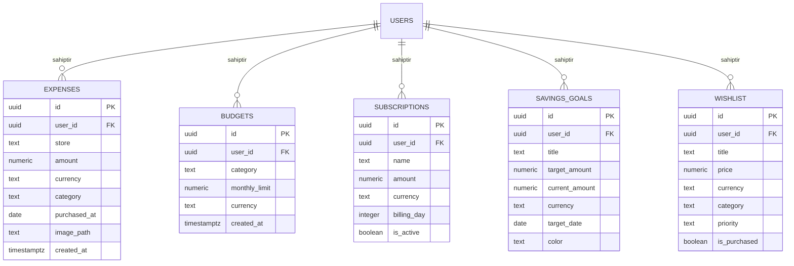

# 🏛️ Fisly — Sistem Mimarisi ve Teknik Tasarım Dokümanı (Architecture Guide)

> **Fisly**, harcama fişlerini yapay zeka ile saniyeler içinde analiz eden, çoklu para birimi ve çoklu dil destekli, sabit abonelikleri, birikim hedeflerini ve akıllı bütçe koçluğunu tek bir obsidian-fintech arayüzünde toplayan yeni nesil kişisel finans asistanıdır.

Bu doküman; projeye yeni dahil olan geliştiricilerin, mimarların veya inceleyenlerin sistemin uçtan uca nasıl çalıştığını, yapay zekanın (AI) nasıl kurgulandığını ve güvenlik katmanlarını eksiksiz anlayabilmesi için hazırlanmıştır.

---

## 📑 İçindekiler
1. [Genel Bakış ve Problem Tanımı](#1-genel-bakış-ve-problem-tanımı)
2. [Uçtan Uca Sistem Mimarisi](#2-uçtan-uca-sistem-mimarisi)
3. [Teknoloji Yığını ve Tercih Nedenleri](#3-teknoloji-yığını-ve-tercih-nedenleri)
4. [Dizin ve Modül Hiyerarşisi](#4-dizin-ve-modül-hiyerarşisi)
5. [Yapay Zeka (AI) Mimarisi ve Veri Boru Hatları](#5-yapay-zeka-ai-mimarisi-ve-veri-boru-hatları)
   - [5.1 Fiş Okuma & Vision OCR Pipeline](#51-fiş-okuma--vision-ocr-pipeline)
   - [5.2 Veri Normalizasyon Motoru](#52-veri-normalizasyon-motoru)
   - [5.3 Finans Koçu AI ("Almalı mıyım?") Motoru](#53-finans-koçu-ai-almalı-mıyım-motoru)
6. [Veritabanı Modeli & Güvenlik (RLS) Mimarisi](#6-veritabanı-modeli--güvenlik-rls-mimarisi)
7. [İstemci Durum Yönetimi (State, Tema, Dil, Para Birimi)](#7-istemci-durum-yönetimi-state-tema-dil-para-birimi)
8. [Üretim Ortamı (Production) Güvenliği & API Anahtarı Yönetimi](#8-üretim-ortamı-production-güvenliği--api-anahtarı-yönetimi)

---

## 1. Genel Bakış ve Problem Tanımı

### Problem
- Geleneksel harcama takip uygulamaları kullanıcılardan her bir faturayı, mağaza adını, tutarı ve tarihi tek tek elle girmesini ister. Bu angarya, kullanıcıların 3-5 gün sonra uygulamayı terk etmesine yol açar.
- Türk fişlerindeki terim karmaşası (`TOPKDV`, `MATRAH`, `NAKİT`, `ÖDENEN`), virgüllü para formatı (`1.234,50 ₺`) ve `GG.AA.YYYY` tarih formatı, küresel standart OCR motorlarının hatalı sonuçlar üretmesine sebep olur.
- Bütçe takibi sadece geçmişi gösterir; kullanıcı alışveriş yaparken o an *"bunu almalı mıyım?"* sorusuna akıllı bir yanıt alamaz.

### Fisly Çözümü
- **Sıfır Manuel Giriş:** Kullanıcı fişin fotoğrafını çeker veya yükler; multimodal yapay zeka saniyeler içinde mağazayı, tutarı, tarihi ve kategoriyi çıkarır.
- **Dirençli Normalizasyon:** AI çıktısı doğrudan veritabanına yazılmaz; bir normalizasyon motorundan geçirilerek tutar ve tarih formatları güvenceye alınır.
- **Bütünleşik Finans Hub'ı:** Yalnızca harcamalar değil; sabit abonelikler (Netflix, Spotify vs.), dijital kumbara (tatil, fon hedefleri) ve istek listesi tek çatı altındadır.
- **Gerçek Zamanlı AI Finans Koçu:** Kullanıcının mevcut ayki bütçesini, kategori harcamasını ve ayın kalan gününü analiz ederek anlık satın alma kararı verir.

---

## 2. Uçtan Uca Sistem Mimarisi

Aşağıdaki şema, istemci tarayıcısından başlayarak Next.js App Router, OpenAI API ve Supabase veritabanı katmanları arasındaki veri akışını özetlemektedir:

```mermaid
graph TD
    User([Kullanıcı / Tarayıcı]) -->|WebRTC Canlı Kamera / Dosya Yükleme| UI[Fisly UI - Next.js 16 Client]
    
    subgraph Frontend Katmanı
        UI -->|Dil / Tema / Para Birimi Context| Contexts[Language, Theme, Currency Context]
        UI -->|Server Actions / API Çağrısı| NextServer[Next.js Server Side]
    end

    subgraph Sunucu Katmanı Next.js App Router
        NextServer -->|Oturum Doğrulama| AuthCheck{Kullanıcı Oturumu Açık mı?}
        AuthCheck -->|Hayır| Err401[401 Unauthorized]
        AuthCheck -->|Evet| RouteReceipt[/api/parse-receipt]
        AuthCheck -->|Evet| RouteCoach[/api/should-i-buy]
        
        RouteReceipt -->|Base64 Görsel + Sistem Promptu| OpenAI_Vision[OpenAI GPT-4o-mini Vision]
        OpenAI_Vision -->|Ham JSON| Normalizer[Receipt Normalizer Engine]
        Normalizer -->|Temizlenmiş Veri| UI
        
        RouteCoach -->|Bütçe & Harcama Sorgusu| SupabaseDB
        RouteCoach -->|Finansal Durum Verisi| OpenAI_Coach[OpenAI GPT-4o-mini Reasoning]
        OpenAI_Coach -->|Karar: Güvenli / Düşün / Ertele| UI
    end

    subgraph Veritabanı ve Depolama Supabase
        NextServer -->|Server Actions: Ekle / Sil / Güncelle| SupabaseDB[(PostgreSQL + RLS)]
        SupabaseDB --> TableExp[expenses]
        SupabaseDB --> TableBudg[budgets]
        SupabaseDB --> TableSubs[subscriptions]
        SupabaseDB --> TableGoals[savings_goals]
        SupabaseDB --> TableWish[wishlist]
        NextServer -->|Opsiyonel Fiş Arşivi| SupabaseStorage[Private Storage: receipts]
    end
```

---

## 3. Teknoloji Yığını ve Tercih Nedenleri

| Katman | Teknoloji | Tercih Nedeni |
| :--- | :--- | :--- |
| **Framework** | **Next.js 16 (App Router)** | Hibrit mimari (Server Components + Client Components). Server Actions ile API boilerplate'ini minimuma indirme. Hassas API anahtarlarını sunucu belleğinde tutma imkanı. |
| **Arayüz Kütüphanesi** | **React 19** | `useActionState` ile form durumlarını ve yüklenme (pending) aşamalarını modern ve temiz yönetme. |
| **Programlama Dili** | **TypeScript** | Uçtan uca tip güvenliği. Veritabanı şemaları, normalizasyon sözleşmeleri ve AI yanıtları için sıfır runtime tipi hatası. |
| **Stil ve Tasarım** | **Tailwind CSS v4** | Obsidian lüks fintech estetiği (mesh gradientler, cam morfin, HSL renk paletleri), anlık açık/koyu tema sınıfları. |
| **Yapay Zeka (AI)** | **OpenAI `gpt-4o-mini` (Vision & JSON Mode)** | Yüksek OCR doğruluğu, Türkçe fiş terimlerini doğru anlama, garantili JSON şeması ve **son derece düşük maliyet** (fiş başına ~$0.001). |
| **Veritabanı & Kimlik** | **Supabase (PostgreSQL + Auth)** | `@supabase/ssr` ile cookie tabanlı güvenli oturum yönetimi. Veritabanı seviyesinde Row Level Security (RLS) ile çoklu kiracı güvenliği. |
| **Depolama (Storage)** | **Supabase Private Storage** | Fiş görsellerini dış dünyaya kapalı, yalnızca oturum açmış kullanıcıya özel klasör bazlı saklama. |
| **Görselleştirme** | **Recharts** | Responsive kategori pasta/çubuk grafikleri, animasyonlu harcama dökümleri. |
| **Test** | **Vitest** | Normalizasyon mantığının ve Türkçe fiş senaryolarının saniyeler içinde doğrulanması. |

---

## 4. Dizin ve Modül Hiyerarşisi

```
tracking_expenses/
├── src/
│   ├── app/                                # Next.js App Router Sayfaları ve API Rotaları
│   │   ├── actions/                        # Sunucu Eylemleri (Server Actions)
│   │   │   ├── auth.ts                     # Login, Signup, SignOut eylemleri
│   │   │   ├── expenses.ts                 # Harcama ekleme, güncelleme, silme
│   │   │   ├── budgets.ts                  # Kategori bütçe limitlerini kaydetme
│   │   │   ├── subscriptions.ts            # Sabit abonelik yönetimi
│   │   │   ├── savings.ts                  # Kumbara hedefleri ve para ekleme
│   │   │   └── wishlist.ts                 # İstek listesi ve satın alma dönüştürme
│   │   ├── api/
│   │   │   ├── parse-receipt/route.ts      # Fiş OCR ve Gemini/OpenAI Vision API rotası
│   │   │   └── should-i-buy/route.ts       # Finans Koçu AI satın alma karar motoru
│   │   ├── login/page.tsx                  # Giriş ve Kayıt ekranı (TR/EN & Tema geçişli)
│   │   ├── wishlist/page.tsx               # İstek Listesi sayfası
│   │   ├── subscriptions/page.tsx          # Sabit Abonelikler sayfası
│   │   ├── savings/page.tsx                # Dijital Kumbara sayfası
│   │   ├── layout.tsx                      # Root layout, fontlar, tema başlangıç scripti
│   │   ├── page.tsx                        # Ana Dashboard (Harcama listesi, özet, grafik)
│   │   └── providers.tsx                   # Theme, Language ve Currency Provider sarmalayıcıları
│   ├── components/                         # Yeniden Kullanılabilir UI Bileşenleri
│   │   ├── Navbar.tsx                      # Üst gezinti çubuğu (Logo, Nav linkleri, Para, Dil, Tema)
│   │   ├── ReceiptUploader.tsx             # Canlı kamera çekimi ve görsel yükleme kartı
│   │   ├── ReceiptConfirmModal.tsx         # AI tarafından okunan verilerin teyit ve düzenleme modalı
│   │   ├── ExpenseSummaryCards.tsx         # Aylık toplam, fiş adedi, ortalama özet kartları
│   │   ├── CategoryChart.tsx               # Kategori dağılım grafiği
│   │   ├── ExpenseList.tsx                 # Arama, filtreleme, sıralama ve CSV dışa aktarma
│   │   ├── BudgetModal.tsx                 # Kategori bütçe belirleme modalı
│   │   ├── FloatingAiCoach.tsx             # "Almalı mıyım?" sağ alt akıllı asistan widget'ı
│   │   ├── LanguageToggle.tsx              # TR / EN dil anahtarı
│   │   ├── CurrencyToggle.tsx              # TRY / USD / EUR / GBP para birimi anahtarı
│   │   └── ThemeToggle.tsx                 # Koyu / Açık tema anahtarı
│   ├── context/                            # React Context'leri
│   │   ├── LanguageContext.tsx             # Çoklu dil (i18n) sözlükleri ve t() kancası
│   │   ├── CurrencyContext.tsx             # Para birimi ve döviz çevrim mantığı
│   │   └── ThemeProvider.tsx               # Dark/Light tema durumu ve HTML root sınıfı
│   ├── lib/                                # Yardımcı Kütüphaneler ve Altyapı
│   │   ├── formatters.ts                   # Para ve tarih formatlama fonksiyonları
│   │   ├── receipt-normalizer.ts           # AI yanıtlarını filtreleyen ve düzelten motor
│   │   └── supabase/                       # Supabase client ve server singleton'ları
│   │       ├── client.ts                   # İstemci taraflı Supabase istemcisi
│   │       ├── server.ts                   # Sunucu taraflı çerezli Supabase istemcisi
│   │       └── middleware.ts               # Oturum koruma middleware'i
│   └── __tests__/                          # Birim Testleri
│       └── receipt-normalizer.test.ts      # OCR normalizasyonunun 14 adet kapsamlı testi
├── public/                                 # Statik Varlıklar
│   ├── logo-light.png                      # Açık tema Fisly logosu
│   ├── logo-dark.png                       # Koyu tema Fisly logosu
│   └── icon-dark.png                       # Favicon ve uygulama ikonu
├── supabase/
│   └── schema.sql                          # Veritabanı tabloları, indeksler ve RLS politikaları
└── README.md                               # Hızlı başlangıç ve kurulum kılavuzu
```

---

## 5. Yapay Zeka (AI) Mimarisi ve Veri Boru Hatları

Fisly, yapay zekayı bir "pazarlama süsü" olarak değil, kullanıcının hayatını kolaylaştıran iki kritik operasyonel hatta kullanır:

### 5.1 Fiş Okuma & Vision OCR Pipeline

Kullanıcı kameradan bir fiş çektiğinde veya galeriden yüklediğinde gerçekleşen işlem adımları:

1. **Görsel Hazırlığı (Client):** Görsel HTML5 File API veya WebRTC Video Canvas aracılığıyla yakalanır.
2. **Güvenli Gönderim (Sunucuya):** `FormData` ile `/api/parse-receipt` uç noktasına iletilir.
3. **Oturum Denetimi:** `supabase.auth.getUser()` çağrılarak istek sahibinin doğrulanmış bir kullanıcı olduğu garanti edilir. Oturumu olmayan istekler OpenAI'a gitmeden reddedilir.
4. **Base64 Dönüşümü & OpenAI Çağrısı:** Görsel `data:image/jpeg;base64,...` formatına dönüştürülür ve `gpt-4o-mini` modeline iletilir.
5. **Prompt Mühendisliği & Türkiye Fiş Kuralları:**
   - **Tutar:** Ara toplamlar (`MATRAH`, `KDV`, `NAKİT`, `PARA ÜSTÜ`) elenerek yalnızca genel `TOPLAM` hedeflenir.
   - **Tarih:** Türk fişlerindeki `GG.AA.YYYY` kuralı modele katı bir kural olarak verilir (Örn: `06.10.2024` -> `2024-10-06`, 10 Haziran değil 6 Ekim).
   - **Kategori:** Model serbest metin yazamaz; yalnızca 8 sistem kategorisinden birini seçebilir (`Market`, `Yeme-İçme`, `Ulaşım`, `Fatura`, `Sağlık`, `Giyim`, `Eğlence`, `Diğer`).
   - **Halüsinasyon Engeli:** Görünmeyen alanlar için modelin tahmin yürütmesi yasaklanmış, `null` dönmesi zorunlu kılınmıştır.

### 5.2 Veri Normalizasyon Motoru (`src/lib/receipt-normalizer.ts`)

LLM'ler zaman zaman küçük format sapmaları yapabilir. Bu nedenle AI çıktısı doğrudan kullanıcıya veya veritabanına aktarılmaz; **Normalizasyon Katmanı**ndan geçer:

```
[OpenAI Ham Yanıtı]
       │
       ▼
┌──────────────────────────────────────────────┐
│  normalizeReceiptData(rawJson)               │
│  ├─ normalizeAmount: "1.250,50 TL" -> 1250.50│
│  ├─ normalizeDate: "14/05/2024" -> 2024-05-14 │
│  ├─ normalizeCategory: Regex -> 8 Kategori   │
│  └─ normalizeConfidence: [0.0 - 1.0] Aralığı │
└──────────────────────────────────────────────┘
       │
       ▼
[Kullanıcı Onay Modalı (ReceiptConfirmModal)]
       │
       ▼
[Supabase "expenses" Tablosu]
```

Bu modül `Vitest` ile 14 farklı test senaryosunda (virgüllü tutarlar, ters tarihler, bilinmeyen kategoriler) sürekli test edilir.

### 5.3 Finans Koçu AI ("Almalı mıyım?") Motoru (`/api/should-i-buy`)

Kullanıcı sağ alttaki widget'tan örneğin *"Bir mont gördüm, 2.500 TL, alsam mı?"* dediğinde:

1. Sunucu kullanıcının `expenses` tablosundan **seçili ayın toplam harcamasını** hesaplar.
2. İlgili kategorideki harcamayı ve `budgets` tablosundaki **kategori limitini** çeker.
3. Ayın kaçıncı gününde olunduğunu ve **ay sonuna kalan gün sayısını** hesaplar.
4. Bu somut finansal veriler OpenAI'a iletilir. Model şu üç karardan birini üretir:
   - 🟢 **GÜVENLİ:** Bütçe aşılmıyor, ayın gününe göre harcama dengeli.
   - 🟡 **DÜŞÜNEREK AL:** Bütçenin sınırına geliniyor veya ay sonuna çok gün var.
   - 🔴 **ERTELE:** Kategori bütçesi aşılıyor veya ayın başında yüksek harcama riski var.
5. Kullanıcıya 2-3 cümlelik samimi bir gerekçe ve uygulanabilir bir tavsiye döner.

---

## 6. Veritabanı Modeli & Güvenlik (RLS) Mimarisi

Supabase üzerinde ilişkisel PostgreSQL kullanılır. Tüm tablolarda **Row Level Security (RLS)** zorunludur:



### RLS Güvenlik Kuralları:
- Her sorgu ve işlemde `auth.uid() = user_id` kuralı çalışır.
- Bir kullanıcı API üzerinden başka bir kullanıcının ID'sini gönderse bile PostgreSQL motoru veriyi döndürmez veya yazmaz.

---

## 7. İstemci Durum Yönetimi (State, Tema, Dil, Para Birimi)

Fisly, harici ağır durum kütüphaneleri (Redux vb.) yerine hafif ve optimize React Context mimarisini kullanır:

1. **`LanguageContext`:**
   - Türkçe (`tr`) ve İngilizce (`en`) tam sözlük desteği.
   - Dil seçimi `localStorage` (`app_lang`) içinde saklanır.
   - Giriş ekranından en uç bildirim modalına kadar tüm metinler `t('key')` ile dinamiktir.
2. **`CurrencyContext`:**
   - ₺ (TRY), $ (USD), € (EUR), £ (GBP) para birimi desteği.
   - Seçilen birim tüm özet kartlarını, bütçeleri ve grafikleri gerçek zamanlı olarak dönüştürür.
3. **`ThemeProvider`:**
   - Koyu (`dark`) ve Açık (`light`) tema desteği.
   - Sayfa ilk yüklenirken oluşabilecek beyaz ekran titremesini (flash of unstyled content) engellemek için `layout.tsx` içinde inline tema scripti çalıştırılır.

---

## 8. Üretim Ortamı (Production) Güvenliği & API Anahtarı Yönetimi

### ❓ Soru: "Canlıya alınca benim API anahtarım mı kullanılacak, bunu nasıl yönetirim?"

Bu soru, uygulamayı yayına alırken en kritik konulardan biridir. Sistem şu prensiplerle tasarlanmıştır:

1. **API Anahtarı Asla İstemciye Sızmaz:**
   - `OPENAI_API_KEY` değişkeninin başında `NEXT_PUBLIC_` **yoktur**.
   - Bu sayede bu anahtar yalnızca sunucu tarafında (`src/app/api/...`) okunur. Tarayıcı kaynak kodunu (DevTools) inceleyen hiç kimse API anahtarınızı göremez.
2. **Yetkisiz İstek Koruması (Auth Wall):**
   - API rotalarının başında Supabase oturum kontrolü bulunur. Giriş yapmamış botlar veya yabancılar API uç noktasını çağıramaz (401 döner).
3. **Maliyet ve Bütçe Kontrolü:**
   - `gpt-4o-mini` modeli son derece ekonomiktir: **1 fiş analizi yaklaşık $0.001 (yaklaşık 3-4 kuruş)** tutar. 1.000 adet fiş okutulsa bile toplam fatura ~$1 civarındadır.
   - OpenAI Dashboard'undan (`platform.openai.com -> Settings -> Billing -> Usage limits`) aylık örneğin **$5** veya **$10** "Hard Limit" (Kesin Tavan) belirleyebilirsiniz. Bu limit dolduğunda kartınızdan 1 kuruş dahi fazla çekilemez.
4. **Dağıtım (Vercel) Süreci:**
   - `.env.local` dosyası git geçmişine eklenmez (`.gitignore` korumalıdır).
   - Vercel'e deploy ederken Vercel Dashboard -> **Settings -> Environment Variables** kısmına `OPENAI_API_KEY`, `NEXT_PUBLIC_SUPABASE_URL` ve `NEXT_PUBLIC_SUPABASE_ANON_KEY` girilir.

---

## 🏁 Özet

Fisly; modern frontend pratikleri (Next.js 16, React 19), sağlam veritabanı güvenliği (Supabase RLS) ve akılcı prompt mühendisliği ile güçlendirilmiş, üretime hazır (production-ready) bir fintech mimarisine sahiptir.
