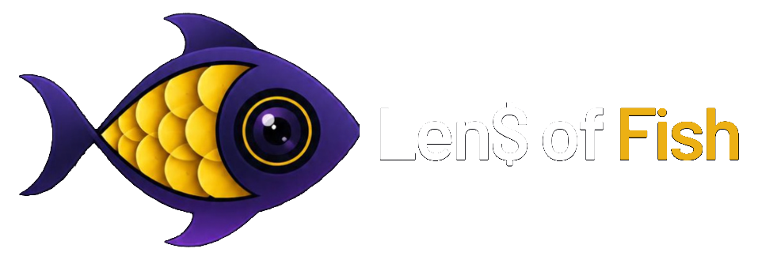

<div align="center">

  

  <p align="center">
    <strong>Akıllı harcama, fiş ve birikim asistanınız</strong><br />
    Fişlerinizi yapay zeka ile saniyeler içinde tarayın, bütçenizi, sabit aboneliklerinizi ve kumbaranızı tek merkezden yönetin.
  </p>

  <p align="center">
    <a href="https://nextjs.org"></a>
    <a href="https://react.dev"></a>
    <a href="https://typescriptlang.org"></a>
    <a href="https://tailwindcss.com"></a>
    <a href="https://supabase.com"></a>
    <a href="https://openai.com"></a>
    <a href="https://vitest.dev"></a>
  </p>

  <p align="center">
    <a href="#-özellikler">Özellikler</a> •
    <a href="#-mimari-ve-teknik-detaylar">Mimari</a> •
    <a href="#-hızlı-başlangıç-kurulum">Kurulum</a> •
    <a href="#-ortam-değişkenleri-env">Ortam Değişkenleri</a> •
    <a href="#-canlıya-alma-deploy">Canlıya Alma</a> •
    <a href="ARCHITECTURE.md">Detaylı Mimari Dokümanı ↗</a>
  </p>

</div>

---

## 🌟 Fisly Nedir?

**Fisly**, geleneksel bütçe uygulamalarının angaryasını ortadan kaldıran yeni nesil kişisel finans merkezidir. Kullanıcıların fişleri elle girmesine gerek kalmaz; kameradan çekilen veya yüklenen fiş fotoğrafı **multimodal yapay zeka** ile taranır ve mağaza adı, tutar, tarih ve kategori otomatik olarak ayrıştırılır.

Fisly yalnızca harcamaları listelemekle kalmaz; **sabit aboneliklerinizi**, **kumbara birikimlerinizi** ve **istek listenizi** tek noktada birleştirir. Sağ altta bulunan **Finans Koçu AI** ise anlık bütçenizi analiz ederek satın alma kararlarınızda size dürüst bir danışmanlık sunar.

---

## ✨ Özellikler

- **🤖 Yapay Zeka Destekli Fiş Okuma (Vision OCR):** Fiş fotoğrafından mağaza adını, KDV dahil genel toplamı, tarihi ve kategoriyi saniyeler içinde otomatik çıkarma.
- **🇹🇷 Türk Fişlerine Özel Normalizasyon:** `TOPLAM`, `TOPKDV`, `MATRAH`, `NAKİT` terimlerini ayrıştırma, `1.234,50 ₺` formatını ve `GG.AA.YYYY` tarih yapısını hatasız tanıma.
- **💳 Sabit Abonelikler & Yinelenen Giderler:** Netflix, Spotify, iCloud gibi yinelenen ödemeleri yönetme, ödeme gününe kalan süreyi ve en yakın faturaları canlı takip etme.
- **🐷 Dijital Kumbara & Birikim Hedefleri:** Tatil, yeni cihaz veya acil fon için hedefler oluşturma, tek tıkla kumbaraya para aktarma ve tamamlanma oranını izleme.
- **🛍️ Akıllı İstek Listesi (Wishlist):** Almayı planladığınız ürünleri görselli/görselsiz kaydetme, tahmini fiyat girme ve tek tıkla harcamaya dönüştürme.
- **🧠 "Almalı mıyım?" Yüzen Finans Koçu AI:** Bir ürün alırken kararsız kaldığınızda, o ayki güncel harcamanızı, kalan bütçenizi ve ayın gününü analiz ederek 🟢 *Güvenli*, 🟡 *Düşünerek Al* veya 🔴 *Ertele* tavsiyesi sunma.
- **🎯 Kategori Bazlı Bütçe Limitleri:** Kategoriye özel harcama limitleri belirleme ve limit aşımlarında görsel uyarılar alma.
- **📊 Görsel Dashboard & Harcama Takvimi:** Kategori dağılım grafikleri, harcama yoğunluk ısı haritası ve geçmiş aylara tek tıkla geçiş.
- **🔍 Anlık Arama, Filtreleme & Excel/CSV İndirme:** Mağaza adına göre filtreleme, kategori filtre hapları ve Türkçe Excel uyumlu UTF-8 CSV dışa aktarımı.
- **🌐 Çoklu Dil (i18n) & Para Birimi:** Giriş ekranı dahil tüm arayüzde tek tıkla **Türkçe (TR) / İngilizce (EN)** ve **₺ (TRY) / $ (USD) / € (EUR) / £ (GBP)** geçişi.
- **🌓 Obsidian Dark & Sleek Light Temaları:** Göz yormayan obsidian mor/indigo koyu mod ve şık aydınlık mod desteği.
- **🔒 Güvenli Veri Mimarisi (RLS):** Her kullanıcının verisi PostgreSQL seviyesinde Row Level Security ile izoledir; kimse başka bir kullanıcının harcamasını göremez.

---

## 🏛️ Mimari ve Teknik Detaylar

Projenin derinlemesine teknik tasarımı, veri akışı diyagramları ve güvenlik politikaları için [**ARCHITECTURE.md**](ARCHITECTURE.md) dosyasını inceleyebilirsiniz.

### 📐 Temel Teknoloji Mimarisi

```
[İstemci: React 19 + Tailwind v4 + Lucide]
                   │
                   ▼ (Server Actions & Route Handlers)
[Next.js 16 App Router (Node.js Server Context)]
   ├── Auth Koruması (Supabase SSR Cookie Auth)
   ├── AI Boru Hattı (OpenAI GPT-4o-mini Vision)
   └── Normalizasyon Motoru (receipt-normalizer.ts)
                   │
                   ▼
[Supabase Bulut Altyapısı (PostgreSQL + RLS + Storage)]
```

---

## 🚀 Hızlı Başlangıç (Kurulum)

Projeyi kendi yerel ortamınızda çalıştırmak için aşağıdaki adımları sırayla takip edin:

### 1. Depoyu Klonlayın ve Bağımlılıkları Yükleyin

```bash
git clone https://github.com/nisaolcucu/tracking_expenses.git
cd tracking_expenses
npm install
```

### 2. Supabase Veritabanını Kurun

1. [Supabase](https://supabase.com/)'da ücretsiz bir proje oluşturun.
2. Sol menüden **SQL Editor** sekmesine gidin.
3. Proje içindeki [`supabase/schema.sql`](supabase/schema.sql) dosyasının tüm içeriğini yapıştırıp **Run** butonuna basın.
   - Bu işlem `expenses`, `budgets`, `subscriptions`, `savings_goals`, `wishlist` tablolarını, indeksleri, RLS politikalarını ve `receipts` storage bucket'ını tek seferde kurar.
4. *(İsteğe Bağlı)* Hızlı test için **Authentication -> Providers -> Email** bölümünden **"Confirm email"** ayarını kapatabilirsiniz.

### 3. Ortam Değişkenlerini Tanımlayın

Kök dizinde `.env.local` dosyası oluşturun (`.env.example` dosyasını kopyalayabilirsiniz):

```bash
cp .env.example .env.local
```

Dosyayı açıp kendi anahtarlarınızı yazın:

```env
# Supabase Dashboard -> Project Settings -> API
NEXT_PUBLIC_SUPABASE_URL=https://proje-id-niz.supabase.co
NEXT_PUBLIC_SUPABASE_ANON_KEY=eyJhbGciOi...anon-key

# OpenAI Platform -> API Keys (https://platform.openai.com/api-keys)
OPENAI_API_KEY=sk-proj-xxxxxxxxxxxxxxxxxxxx
```

### 4. Geliştirme Sunucusunu Başlatın

```bash
npm run dev
```

Tarayıcınızda [http://localhost:3000](http://localhost:3000) adresine giderek Fisly'i kullanmaya başlayabilirsiniz!

### 5. Birim Testlerini Çalıştırın

AI normalizasyon motorunun testlerini çalıştırmak için:

```bash
npm test
```

---

## 🔑 Ortam Değişkenleri (.env)

| Değişken | Açıklama | Konum |
| :--- | :--- | :--- |
| `NEXT_PUBLIC_SUPABASE_URL` | Supabase projenizin API uç noktası | İstemci & Sunucu |
| `NEXT_PUBLIC_SUPABASE_ANON_KEY` | Supabase anonim istemci anahtarı (RLS korumalı) | İstemci & Sunucu |
| `OPENAI_API_KEY` | GPT-4o-mini Vision ve Finans Koçu için OpenAI anahtarı | **Yalnızca Sunucu (Gizli)** |

> [!IMPORTANT]
> `OPENAI_API_KEY` değişkeninin başında `NEXT_PUBLIC_` bulunmaz. Bu sayede anahtarınız asla tarayıcıya veya istemci koduna sızdırılmaz; yalnızca güvenli sunucu tarafında çalışır.

---

## ☁️ Canlıya Alma (Deploy)

Fisly, [Vercel](https://vercel.com/) üzerinde sıfır yapılandırmayla tek tıkla çalışacak şekilde optimize edilmiştir:

1. Projenizi GitHub'a gönderin (zaten git repository'nizde hazırdır).
2. [Vercel Dashboard](https://vercel.com/)'a gidip **"Add New Project"** diyerek bu depoyu seçin.
3. **Environment Variables** bölümüne yukarıdaki 3 anahtarı (`NEXT_PUBLIC_SUPABASE_URL`, `NEXT_PUBLIC_SUPABASE_ANON_KEY`, `OPENAI_API_KEY`) ekleyin.
4. **Deploy** butonuna basın. Projeniz 1 dakika içinde `https://projeniz.vercel.app` adresinde canlıya geçecektir!

---

## 🛡️ Güvenlik & Gizlilik

- **Row Level Security (RLS):** Hiçbir kullanıcı bir başkasının harcamasına, aboneliğine veya hedefine erişemez.
- **Özel Depolama (Private Storage):** Fiş fotoğrafları halka açık değildir; yalnızca oturum sahibi erişebilir.
- **Yetkisiz Çağrı Koruması:** `/api/parse-receipt` ve `/api/should-i-buy` API rotaları oturum kontrolüyle kilitlenmiştir.

---

## 📄 Lisans

Bu proje [MIT Lisansı](LICENSE) altında geliştirilmiştir.
Dilediğiniz gibi geliştirebilir, özelleştirebilir ve kullanabilirsiniz.
